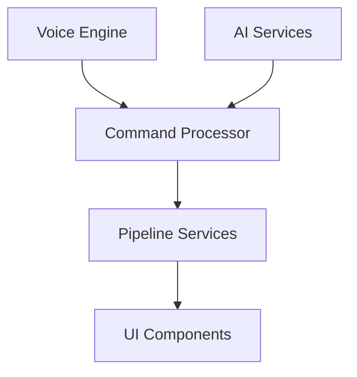
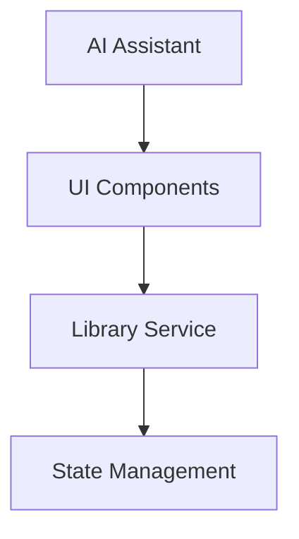

# Technology Stack Comparison

## Overview

This document compares the technology stacks used in both repositories, highlighting the different approaches and tools used in each.

## Main Repository (Performia)

### Core Technologies

1. Audio Processing & Real-time Engine
   - **JUCE Framework**
     - C++ audio framework
     - Real-time audio processing
     - Low-latency I/O handling
     - MIDI input processing
   
   - **Voice Engine**
     - Python wrapper around JUCE
     - Real-time voice analysis
     - Command processing system
     - OSC communication

2. Backend Services
   - **Python Microservices**
     - FastAPI for API endpoints
     - Pydantic for data validation
     - asyncio for async operations
     - uvloop for performance optimization

   - **AI/ML Pipeline**
     - OpenAI integration
     - Anthropic Claude integration
     - LangChain for AI orchestration
     - NumPy/Pandas for data processing

3. Data Processing
   - **Audio Analysis Pipeline**
     - Speech recognition (ASR)
     - Beat detection
     - Chord analysis
     - Melody extraction
     - Audio separation

4. Infrastructure
   - **Kubernetes**
     - Service orchestration
     - Container management
     - Scaling configuration
   
   - **GCP Integration**
     - Cloud deployment
     - Storage management
     - Service integration

5. Frontend (Basic)
   - **React 19**
     - Basic UI components
     - TypeScript integration
     - Vite build system

### Development Tools
- CMake for C++ builds
- Python virtual environments
- Git for version control
- Docker for containerization
- Kubernetes tooling

## Frontend Repository (Performia-front)

### Core Technologies

1. UI Framework
   - **React 19**
     - Functional components
     - React Hooks
     - Custom hook library
     - State management with Immer

2. Styling System
   - **Tailwind CSS**
     - Utility-first CSS
     - PostCSS processing
     - Custom theme configuration
     - Responsive design system

3. Development Environment
   - **TypeScript**
     - Strict type checking
     - Advanced type definitions
     - Enhanced IDE support
   
   - **Vite**
     - Fast HMR
     - Build optimization
     - Development server
     - Plugin system

4. AI Assistance
   - **Python-based Tools**
     - direct-assist.py
     - vizitrtr-bridge.py
     - Integration helpers

### Development Tools
- Node.js ecosystem
- npm/yarn package management
- TypeScript compiler
- Vite dev server
- PostCSS processing

## Technology Comparison Matrix

| Category | Main Repository | Frontend Repository |
|----------|----------------|-------------------|
| **Languages** | C++, Python, TypeScript | TypeScript, Python |
| **Core Framework** | JUCE, FastAPI | React |
| **Build Tools** | CMake, Python tools | Vite, TypeScript |
| **Styling** | Basic CSS | Tailwind CSS + PostCSS |
| **State Management** | Custom + Immer | Immer |
| **AI Integration** | OpenAI, Anthropic, LangChain | Custom AI tools |
| **Testing** | Python unittest, C++ tests | React Testing Library |
| **Deployment** | Kubernetes, GCP | Static hosting |

## Integration Points & Data Flow

### Main Repository

### Frontend Repository

## Performance Considerations

### Main Repository
- Low-latency audio processing (JUCE)
- Optimized Python services (uvloop)
- Efficient data pipeline
- Kubernetes scaling

### Frontend Repository
- Fast development iterations
- Optimized builds (Vite)
- Efficient styling (Tailwind)
- Quick state updates (Immer)

## Development Experience

### Main Repository
- Complex setup requirements
- Multiple language environments
- Comprehensive testing needs
- Infrastructure management

### Frontend Repository
- Quick start development
- Hot Module Replacement
- Rich developer tools
- Immediate feedback

## Future Considerations

### Technologies to Merge
1. Styling System
   - Integrate Tailwind into main repo
   - Unified styling approach
   - Consistent visual language

2. Development Tools
   - Share AI assistance tools
   - Unified testing approach
   - Common build pipeline

3. State Management
   - Consistent Immer usage
   - Unified data flow
   - Shared type definitions

### Technologies to Keep Separate
1. Core Processing
   - JUCE/C++ engine
   - Python services
   - AI/ML pipeline

2. Deployment
   - Kubernetes orchestration
   - Frontend static hosting
   - Service management

## Migration Strategy

### Phase 1: Frontend Enhancement
- Integrate Tailwind CSS
- Merge AI assistance tools
- Update build configuration

### Phase 2: Backend Integration
- Enhance API communication
- Streamline data flow
- Optimize performance

### Phase 3: Development Tools
- Unify development experience
- Consolidate testing
- Standardize deployment

## Recommendations

1. Technology Consolidation
   - Maintain separation of concerns
   - Share development tools where possible
   - Keep deployment strategies distinct

2. Development Experience
   - Unified developer tooling
   - Consistent coding standards
   - Shared documentation approach

3. Performance Optimization
   - Keep low-latency processing
   - Optimize UI rendering
   - Efficient data flow

4. Future Scalability
   - Flexible architecture
   - Modular components
   - Clear integration points
